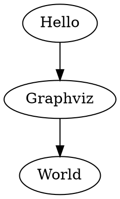

# はじめに
本記事は、今回筆者が作成したHaskellのエフェクトシステムライブラリの背景を説明するものです。Haskellに触れたことがない読者のために、理解に必要な事柄や文法等は記事中で簡単に説明します。Haskellやライブラリ自体に興味がなくとも、エフェクトシステムの紹介だけでも今後の参考にしていただければ幸いです。

https://github.com/sayo-hs/heftia

## エフェクトシステム

　*エフェクトシステム*というプログラミングパラダイムが以前より研究されていました。

これは、プログラムのコード内で起こりうる副作用を分類、タグ付けし、実行時より前に分かるようにするというものです。ここでは、副作用を分類して名前を付けて型として表したものを*エフェクト型*と呼び、あるコード片が発生させうるすべてのエフェクト型の集合を*エフェクト集合*と呼ぶことにします。

例えば

* ```1+1```
  このプログラムのエフェクト集合は空集合`{}`です。なぜなら、一切の副作用（入出力）を発生させないからです。

* ```print(1)```
  このプログラムのエフェクト集合は、`{Console}`です。Consoleは、コンソールの標準入出力の副作用を表すエフェクト型です。

* ```sendMessage("192.168.1.3", "hello")```
  このプログラムのエフェクト集合は`{Network}`です。Networkは、ネットワークアクセスという副作用を表すエフェクト型です。

* ```
  {
    print("Sending message to 192.168.1.3 ...");
    sendMessage("192.168.1.3", "hello");
  }
  ```

  このプログラムのエフェクト集合は`{Console, Network}`です。このプログラムは、コンソールとネットワークの両方にアクセスするという副作用を持ちます。

* ```
  {
    input := read();
    if (input == "y") {
      sendMessage("192.168.1.3", "hello");
    }
  }
  ```

  このプログラムは、ユーザーから標準入力を受け取り、`"y"`が入力されたときだけネットワークにデータを送信します。他の文字列が入力されたときは、ネットワークへのアクセスの副作用は発生しません。このプログラムのエフェクト集合は`{Console, Network}`です。

  このように、実行される条件によって副作用が発生したりしなかったりする場合であっても、その副作用はエフェクト集合に含まれます。つまり、エフェクト集合とは潜在的に発生しうるすべてのエフェクトを列挙したものです。

　さらに、型を書くことでプログラムの副作用を制限することができます。例えば

```
function f() : <Console> {
  print("hello"); // OK
  sendMessage("192.168.1.3", "hello"); // => コンパイルエラー: エフェクト'Network'は許可されていません。使用可能なエフェクトは'Console'のみです。
}
```

のように、`: <Console>`でエフェクト集合を指定すると、`f`内部ではネットワークアクセスは一切不可能という制約を課すことができる、というイメージです。

ここまでの例ではエフェクトの単位がコンソールとネットワークだけで分離が大雑把ですが、エフェクトはユーザーが自由に定義できるので、必要に応じてどこまでも細かい副作用の分離が可能です。例えば

* 特定のサブネットのみへのアクセスが可能なエフェクト型 `SubNetwork<"192.168.0.0/16">`
* 特定のディレクトリに対する読み取りのみが可能なエフェクト型 `FileSystem<"/home/foobar", ReadOnly>`

などが考えられます。

　エフェクトシステムは、このように**最小権限の原則**的なプログラミングスタイルを可能にします。

**起きうる副作用を事前に把握できることによるコードの把握可能性の向上、本来不要な副作用を実行前に検出・排除することによる安全性の向上が期待できます。** つまり、エフェクトシステムとはいわゆるprivate/public修飾子のような、アクセス制御的な機構であると言えます。


[Haskellのつまづきやすいポイントを解説 ～モナドと effect system ～](https://techblog.asahi-net.co.jp/entry/2024/07/29/110101)より:
> 通常 effect system を使うと、単に1種類の作用を書くだけでなく、複数の作用を組み合わせて同時に使ったり、作用を他の作用に変換することができるようになります。これにより作用をモジュラーに書けますし、「どんな作用が含まれるか」を型レベルで細かく記述できるようになります。細かく分けられた型を使うことで、プログラマの設計意図をコード上に表現したり、プログラムを安全にしたりすることができます。

　なお通常のエフェクトの解説ですとエフェクトハンドラというものについても説明するのですが（むしろエフェクトの便利さはそっちのほうがメイン）、これの関しては既存の記事が詳しくわかりやすいので、ここでは概要だけ説明します。

[我々向けの Algebraic Effects 入門 - overreacted.io](https://github.com/gaearon/overreacted.io/blob/archive/src/pages/algebraic-effects-for-the-rest-of-us/index.ja.md)

エフェクトというのは同時にインターフェースでもあります。つまり、エフェクトを発生させるコードを書いた後で、そのエフェクトを具体的にどういう処理とするかという裏方の実装が必要です。つまり、Javaで言うところの`interface`に対する`class`であり、Rustで言うところの`trait`に対する`impl`です。これを行うための仕組みがエフェクトハンドラです。
エフェクトパラダイムのユーザーは、ユーザーが独自に定義したエフェクトに対して、さらにそのエフェクトをどう処理するかの実装をエフェクトハンドラによって与えることができます。一つのエフェクトに対して複数の実装（エフェクトハンドラ）を用意し、どれを使用するかを実行時（動的）に切り替えることができます。エフェクトハンドラは、（使い方はそれに限られませんが）DIにおいて効果を発揮すると言えます。例えば

* 本番用のエフェクトハンドラとモックのエフェクトハンドラを作成し、テスト時とリリース時でハンドラを差し替える
* 非同期エフェクトasync/awaitに対して

  1. OSのスレッドに基づくもの
  2. OSのプロセスに基づくもの
  3. グリーンスレッドに基づくもの

  の3種類の非同期バックエンドハンドラを用意し、用途に応じて最もパフォーマンスが出る非同期バックエンドを選び取り使用する。async/awaitを使用する（async/awaitエフェクトを呼び出す）コードを一切変更せずに、非同期バックエンドのみ差し替える。

といったことが可能になります。

　エフェクトはReactの設計思想において部分的に取り入れられているようです。また、エフェクトが言語機能として組み込まれたMicrosoft製のKoka言語のほか、最近ではEpic Gamesが開発中のゲーム開発向け言語であるVerseにも部分的に取り入れられ[^9]一部で話題となるなど、少しづつですが注目されてきているようです。

 あとWASM Componentもかなりエフェクトっぽいです。フットプリントの軽いコンテナ技術がますます要求される現代において、エフェクトシステムはプログラムのisolationを言語のレイヤーで軽量に提供する技術としてのポテンシャルを秘めているのではないかと筆者は考えています。

 エフェクトシステムにおいては発生しうる副作用の情報がコンパイル時にすべて手に入るため、プログラム外部へのアクセス権に関する検査を静的に行うことができます。近いアイデアとして、エフェクトシステムほど副作用を細かく分類することはできませんが、既にHaskellにはSafe Haskellという機能が実装されており、実際に使うことができます[^8]。筆者は将来的には**本ライブラリとSafe Haskellを組み合わせて、セキュリティ用途で使用できるエフェクトシステムをHaskell上に構築**したいと考えています。

## Haskell、モナド、EDSL

　Haskellを知らない人にも伝わるように背景を説明します。

　Haskellという関数型言語があります。この言語は非常に特徴的で、中でも有名なのが「モナド」という仕組みです。モナドとは「プログラマブルな制御構造」であり、これはいわばHaskellという言語の中にユーザーが新しい言語 (DSL; ドメイン特化言語) を作ることができるということを意味します。

　例を挙げましょう。グラフ構造の図を記述するdot言語というものがあります。例えば



というコードから、Graphvizという描画ソフトを使うと以下のような図を生成できます:


　さて、ここにGraphvizを呼び出すことができるHaskellライブラリがあります: [https://gitlab.com/daniel-casanueva/haskell/graphviz](https://gitlab.com/daniel-casanueva/haskell/graphviz)
これを使うと、以下のようなHaskellコードで同じことができます。

```haskell
hello :: DotGraph Text
hello = digraph' do
  "Hello"    --> "Graphviz"
  "Graphviz" --> "World"
```

参考: [dot言語を使わずにGraphvizでグラフを描く便利なライブラリ](https://qiita.com/lotz/items/4443a3ccb35780fa0c00)

　あたかもdot言語をHaskellの中に書いているかのようです。このように、他の言語をHaskell内でモナドとして定義して組み込めることがあります。ライブラリという形で他の言語を自身の言語の内部に作り出すことは、しばしば「埋め込み」 (embedding) と呼ばれます。このとき、埋め込まれる他言語 (DSL) は EDSL (Embedded DSL) と呼ばれます。

[Embedded domain specific language](https://wiki.haskell.org/Embedded_domain_specific_language)

　つまり先程の例では、dot言語をHaskellの中に「埋め込んで」いるのです。

## 高階エフェクト

:::message
　ここからは例示する疑似コードがHaskell風の文法に変わります。これはシェルスクリプトに似ています:

* 手続きのコードブロックは波括弧`{ a; b; c; }`の代わりに

    ```haskell
    do
      a
      b
      c
    ```

* 関数呼び出しは`f(a,b,c)`の代わりに

  ```haskell
  f a b c
  ```

* 複数引数の関数の型は、`f : (arg1,arg2,arg3) -> ret`の代わりに

  ```haskell
  f :: arg1 -> arg2 -> arg3 -> ret
  ```
:::

以前よりHaskellコミュニティでは、ある種の別言語と言えるエフェクトシステムを、ライブラリという形でHaskellに埋め込もうとする試みが行われていました。

その試みの産物である既存のライブラリたちは、一階のエフェクトについてはとても便利に扱うことができます。一方で、高階のエフェクトの扱いに難があります。

*一階のエフェクト*というのは単純な形のエフェクトのことであり、先程のConsole, Networkなどに加えて、例えば

```haskell
log :: LogLevel -> String -> m ()
```

という、ログを出力するエフェクトが考えられます。ログレベルとログメッセージの文字列を引数として取り、結果の型が空`()`のコードブロック（プログラム）の型である`m ()`を返します。以下のように使えます:

```haskell
do
  log Info "Greeting..."
  print "Hello, World!"
```

　一方で*高階のエフェクト*というのは、以下のようなものです[^1]:

```haskell
span :: String -> m a -> m a
```

　これはいわゆる分散トレーシングにおけるスパンを表現するのに使えるエフェクトです。使用例を見ると分かりやすいと思います。

```haskell
span "greeting" do
  print "Hello, World!"
```

　スパンの名前を第1引数に取り、そのスパンで囲い込むコードブロックを第2引数に取ります。このコードを分散トレーシングのシステムに接続すると、`"Hello, world!"` が表示されるタイミングで `start 'greeting'` と `end 'greeting'` が記録されるイメージです。

　このように、エフェクトの引数に純粋な値ではなく副作用を持ったコードブロック（プログラム）を取るようなものを高階のエフェクトと呼びます。

　高階エフェクトが使えると、特にロギング、分散トレーシング、並行処理、探索処理のようなコードを書く際に便利に応用することができます。しかしながら、高階エフェクトを筋良く、ユーザーの使いやすい形で実現するのは、理論的・技術的な困難があります。既存のエフェクトシステムライブラリのすべてにおいて、高階エフェクトを使用した際に

1. 高階エフェクトのハンドラを簡潔に書くのが困難
2. 期待される正常な挙動が実現されない/できない [^2][^3]
3. エフェクト (Algebraic Effects) の本来可能な能力をフルで引き出せない[^4]

という問題を抱えています[^5]。これらの問題を認識し解決を試みているものが1つだけ知られていますが、現在これは実用環境にて動作する状況にありません[^6]。

筆者はこれらの問題の解決に焦点を当てています。特に3.の点が非常にもったいないと感じていました。そこで、以下の論文から着想を得たことで実際に動作するライブラリを作ることに成功し、問題を解決できたのではないかと思います。この論文がなければ作れませんでした。
[Casper Bach Poulsen and Cas van der Rest. 2023. Hefty Algebras: Modular Elaboration of Higher-Order Algebraic Effects. Proc. ACM Program. Lang. 7, POPL, Article 62 (January 2023), 31 pages.](https://dl.acm.org/doi/10.1145/3571255)

また、Kokaなどのエフェクトを組み込んだ既存の言語と比較しても

1. Algebraic Effectsの機能をほとんどフルで実現[^4]
2. 高階エフェクトをサポート
3. エフェクトシステム（エフェクトの静的検査）をサポート
4. 実際にプログラミングに使用可能

の4つを同時にクリアしたのは本ライブラリが最初ではないかと思います。例えばKokaは2.を、OCaml 5.0のエフェクト機能は3.をサポートしていないようです[^7]。

1年ほど個人で開発を続け、最近ようやく日常のプログラミングで実用できる程度の水準にまで育ったと感じているので、エフェクトシステムに興味のあるHaskellerの方は使用して感想をいただけると励みになります。

本ライブラリはまだまだドキュメントが不足しています。そこで、本ライブラリの使い方の入門編として以下のシリーズを執筆しました。本記事の続きとして読んでいただければ幸いです。
* [Heftiaエフェクトシステムライブラリ入門 Part 1 - 一階エフェクト](https://zenn.dev/lanexpr/articles/9061f0121f3cf5)
* [Heftiaエフェクトシステムライブラリ入門 Part 2 - 高階エフェクト](https://zenn.dev/lanexpr/articles/b63f31525c0a4d)
* [Heftiaエフェクトシステムライブラリ入門 Part 3 - 限定継続](https://zenn.dev/lanexpr/articles/de512ce5650518)

また、コードの例としてGitHubに https://github.com/sayo-hs/heftia?tab=readme-ov-file#example や https://github.com/sayo-hs/heftia/tree/v0.3.0/heftia-effects/Example がありますので参考になれば幸いです。

https://github.com/sayo-hs/heftia

質問等歓迎です！

## 参考文献

* エフェクトシステム

    * [Haskellのつまづきやすいポイントを解説 ～モナドと effect system ～ - 朝日ネット　技術者ブログ](https://techblog.asahi-net.co.jp/entry/2024/07/29/110101)

        Haskellにおける従来型のエフェクトシステムの使い方について解説がされています。

* 代数的エフェクト
    * [我々向けの Algebraic Effects 入門 - overreacted.io](https://github.com/gaearon/overreacted.io/blob/archive/src/pages/algebraic-effects-for-the-rest-of-us/index.ja.md)

        JavaScriptに代数的エフェクトの機能が追加された疑似コードを使って、初心者にもわかりやすく解説がされています。

    * [@Nymphium氏による代数的エフェクトの解説集](https://nymphium.github.io/tags.html#Algebraic%20Effects-ref)
        代数的エフェクトについて、コードによる応用例を交えて解説がされています。

        * [Algebraic Effectsとは? 出身は? 使い方は? その特徴とは? 調べてみました! - lilyum ensemble](https://nymphium.github.io/2018/10/30/what-is-algebraic-effects.html)
        * [Algebraic Effectsの型システム入門 - lilyum ensemble](https://nymphium.github.io/2019/08/10/ae-type-system.html)
        * [Algebraic EffectsとExtensible Effectsの違いってなんや? 関係あんの? - lilyum ensemble](https://nymphium.github.io/2020/03/15/ae-ee.html)

* Extensible Effects

    * [作って学ぶ Extensible Effects @ NB-Scala レトロスペクティブ](https://docs.google.com/presentation/d/1Jr39N-oFe4yhJQ7tqNWRHJuyolaT3cDAKzZMHsJ6KWY/edit#slide=id.g2e57bb62540_0_13)

        Extensible Effectsをある種のアセンブリ言語として捉えることで直感的な理解を目指したスライドです。


[^1]: ここで`a`は型変数（いわゆるジェネリクス）。任意の型`a`を結果の型とするコードブロックを引数に取り、 エフェクトハンドラにより`a`を結果の型とする新しいコードブロックへと書き換えられ返却される。
[^2]: [Polysemy #246 \<bug\> \<weird semantics\> : Choice of functorial state for runNonDet](https://github.com/polysemy-research/polysemy/issues/246)
[^3]: [The effect semantics zoo](https://github.com/lexi-lambda/eff/blob/master/notes/semantics-zoo.md)
[^4]: 限定継続を操作する能力。これがあると、コルーチンやasync/awaitをエフェクトとしてシームレスにシステムに組み込んで使うことができるようになり非常に便利。その他、エフェクトを動的に書き換える機能など。
[^5]: ライブラリごとに機能を比較した表: https://github.com/sayo-hs/heftia?tab=readme-ov-file#comparison
[^6]: [eff — screaming fast extensible effects for less](https://github.com/lexi-lambda/eff)
[^7]: もし筆者の把握していない例をご存知でしたら教えていただけると助かります…　参考: https://gist.github.com/ymdryo/6fb2f7f4020c6fcda98ccc67c090dc75 https://discuss.ocaml.org/t/am-i-wrong-about-effects-i-see-them-as-a-step-back/10829
[^8]: Haskellでは基本的に、あるコードが副作用を持つか持たないかの2種類に型によりラベル付け/分離がされます。しかし標準ではエスケープハッチとして、名前がunsafeから始まる関数を使うことで「副作用なしラベル」が付けられたコードからも副作用を起こすことができます。Safe Haskellは、このエスケープハッチを閉じることで、型情報から漏れるような副作用を完全に禁止し、セキュリティ目的でラベルを使えるようになります。: http://www.kotha.net/ghcguide_ja/7.6.2/safe-haskell.html
[^9]: [Verse言語の設計思想を読み解きたい（16）　エフェクト指定子 - t_tutiya](https://zenn.dev/t_tutiya/articles/a762bb727e255f)
